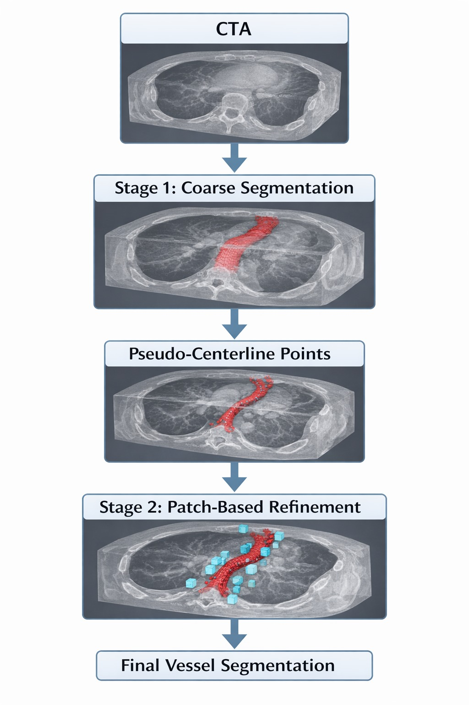
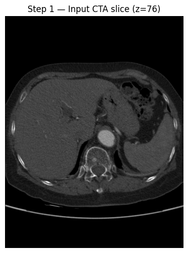
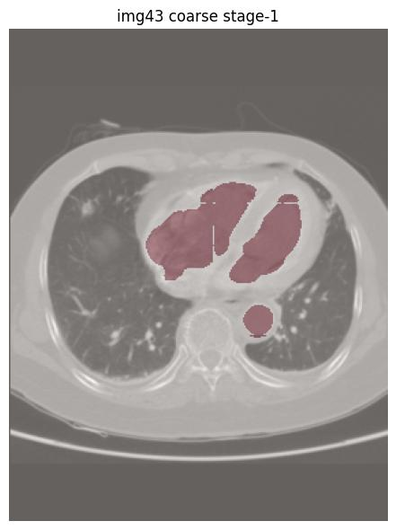
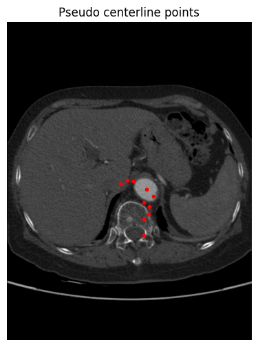
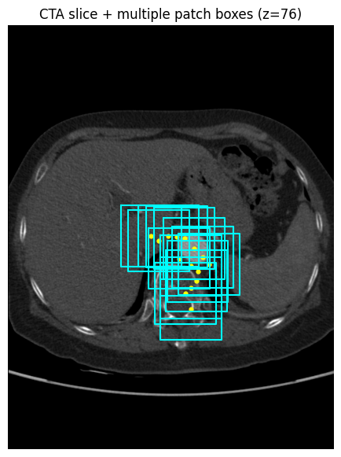
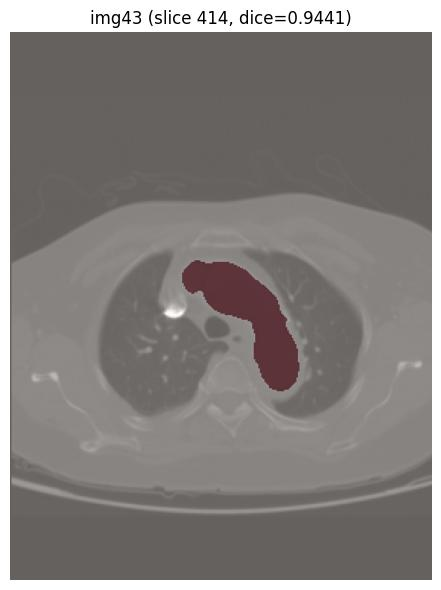
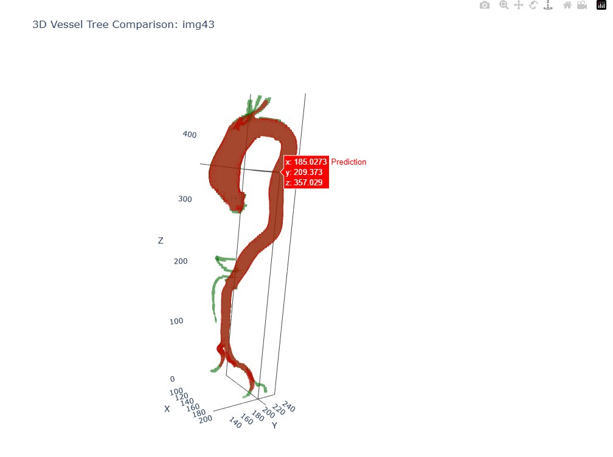

# AVTSeg: 3D Aortic Vessel Segmentation from CTA

A two-stage deep learning pipeline for **3D segmentation of the aortic vessel tree from CT Angiography (CTA)**.

The pipeline performs **coarse vessel localization**, extracts **pseudo-centerline points**, samples **local patches**, and performs **refined segmentation** to produce the final vessel tree.

---

## Pipeline Overview

Pipeline stages:

1. CTA Volume Input  
2. Stage-1 Coarse Segmentation  
3. Pseudo Centerline Extraction  
4. Patch Sampling Along Vessel  
5. Stage-2 Patch Refinement  
6. Final 3D Vessel Segmentation

---

# Method Overview

The system uses a **two-stage segmentation strategy**.

### Stage-1: Global Vessel Localization

A 3D segmentation model predicts a **coarse vessel mask** over the entire CTA volume.

This provides:

- approximate vessel location
- vessel topology
- candidate centerline points

---

### Pseudo Centerline Extraction

From the coarse vessel mask, **centerline points are estimated**.

These points indicate the **central path of the vessel tree** and guide patch sampling.

---

### Patch Sampling

Instead of processing the full volume again, the algorithm samples **local patches around centerline points**.

This allows the second model to focus on **high-resolution vessel refinement**.

---

### Stage-2: Patch-Based Refinement

A second segmentation model refines the vessel segmentation locally using the sampled patches.

Outputs are merged into the final **3D vessel tree segmentation**.

---

# Example Pipeline Output

### Step 1 — Input CTA Slice

---

### Step 2 — Stage-1 Coarse Segmentation

---

### Step 3 — Pseudo Centerline Extraction

---

### Step 4 — Patch Sampling

---

### Step 5 — Stage-2 Refinement

---

### Step 6 — 3D Vessel Tree Comparison

Ground truth vs predicted vessel tree.

